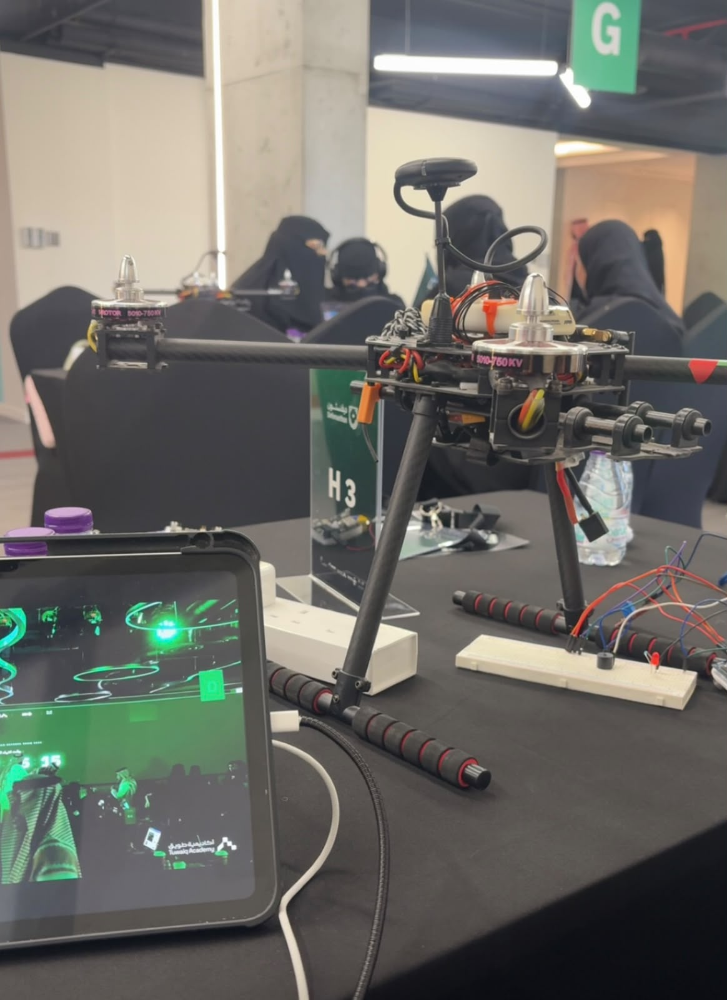

# Mine Detection Using a Drone

## Project Overview

A prototype project that aims to simulate the detection of landmines using sensors mounted on a drone model.

## Project Idea

The project uses sensors to detect metal objects and measure the distance from the ground. The collected readings are displayed through the Arduino Serial Monitor.

## Components Used

- Arduino
- Metal Sensor
- TF-Mini LiDAR
- Buzzer
- Drone Model

## How It Works

1. The metal sensor detects nearby metal objects.
2. The TF-Mini LiDAR measures the distance.
3. The sensor readings are displayed on the Arduino Serial Monitor.
4. The buzzer provides an alert when a metal object is detected.

## Project Goal

The goal of this project is to demonstrate a prototype concept for using drone technology and sensors to assist in the initial detection of landmines in dangerous areas.

## Project Status

This project is a prototype and simulation. The drone model is stationary and does not fly. The project demonstrates the concept and the interaction between the sensors and Arduino.
